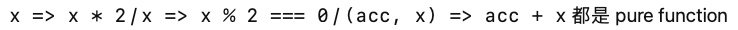
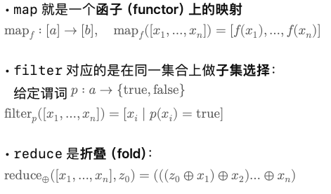
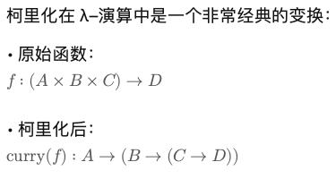
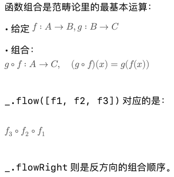
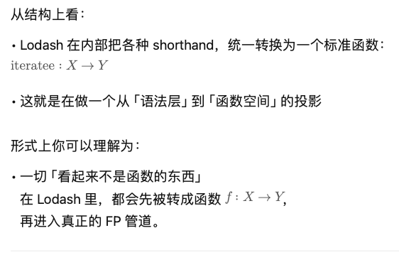
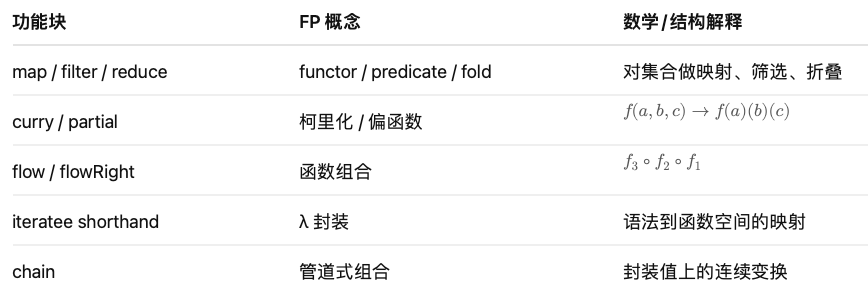

# Lodash 的 FP 结构分析（工程版 / 数学版）

很多前端工程师对 FP 的第一印象，不是 Haskell、不是 λ–演算，而是一个很“接地气”的库：

> **Lodash**

在工程语境里，Lodash 其实扮演了「函数式编程标准库」的角色：

* 把高频的数组 / 对象操作，包装成**纯函数工具**
* 提供 curry、partial、flow 等**组合工具**
* 用“iteratee shorthand”降低函数式写法门槛

这篇文章从两个角度拆解 Lodash 的 FP 特性：

1. **工程视角：Lodash 是怎样把 FP 变成“好用的工具库”的？**
2. **数学视角：这些函数在结构上，其实对应哪些 FP / 代数概念？**

---

## 1. map / filter / reduce：FP 的「三件套」

### 1.1 工程视角

```js
import _ from "lodash"

const arr = [1, 2, 3, 4]

const doubled = _.map(arr, x => x * 2)       // [2, 4, 6, 8]
const evens   = _.filter(arr, x => x % 2 === 0) // [2, 4]
const sum     = _.reduce(arr, (acc, x) => acc + x, 0) // 10
```

这里有几个 FP 关键点：

* **纯函数**：
* **不可变性（immutability）**：不修改 arr
* **声明式**：描述“映射”或“筛选”，不是 for 循环

### 1.2 数学视角

如果把数组看成一个有限集合：
>


---

## 2. curry / partial：λ–演算里的“形参拆解”

### 2.1 工程视角

```js
const add = (a, b, c) => a + b + c
const curried = _.curry(add)
curried(1)(2)(3) // 6
```

工程收益：

* 可部分应用（partial application）
* 适合与 map/filter 组合
* 提升函数复用性
 
_.partial 则是简单版的 curry：
```js
const add2 = _.partial(add, 2)

add2(10, 20) // 等价于 add(2, 10, 20)
```

### 2.2 数学视角

柯里化的 λ–演算表达：



表达能力相同，但结构更适合组合（composition）。


---

## 3. flow / flowRight：函数组合（composition）

### 3.1 工程视角

```js
import _ from "lodash"

const double = x => x * 2
const inc    = x => x + 1

const doubleThenInc = _.flow([double, inc])
doubleThenInc(3) // (3 * 2) + 1 = 7

const incThenDouble = _.flowRight([double, inc])
incThenDouble(3) // double(inc(3)) = 8
```
工程上，这让逻辑变成：
*	一串小而纯的函数
*	用 flow / flowRight 把它们串起来
*	让业务逻辑语义更接近“数据流”

### 3.2 数学视角



你可以把 Lodash 的 flow 看成：

>把「一个复杂函数」拆解为「一串简单函数的组合表达」，
保证结构符合数学上的组合律。

---

## 4. iteratee shorthand：语法糖转 λ 表达式

### 4.1 工程视角

```js
const users = [
    { name: 'alice', age: 18 },
    { name: 'bob',   age: 20 },
]

// 属性名字符串 shorthand：
_.map(users, 'name')
// => ['alice', 'bob']

// 匹配对象 shorthand：
_.filter(users, { age: 18 })
// => [{ name: 'alice', age: 18 }]
```

工程上，这大大减少了箭头函数的噪音：
*	'name' 被当作 user => user.name
*	{ age: 18 } 被当作 user => user.age === 18

### 4.2 数学视角


---

## 5. chain：把 FP 操作串成一条数据变换管道

### 5.1 工程视角

```js
_.chain([1,2,3])
  .map(...)
  .filter(...)
  .sum()
  .value()
```

### 5.2 数学视角

理解成“封装值上的连续变换”（轻量 Monad 风格）。

*	chain(value) 把 value 包进一个「上下文」
*	每一步操作都在这个上下文里产生新的“封装值”
*	.value() 把最终值取出来

---

## 6. 小结：Lodash = 前端工程里的 FP 标准库



> **Lodash 把 FP 的抽象概念，做成了前端工程世界里的“数学友好工具箱”。**
