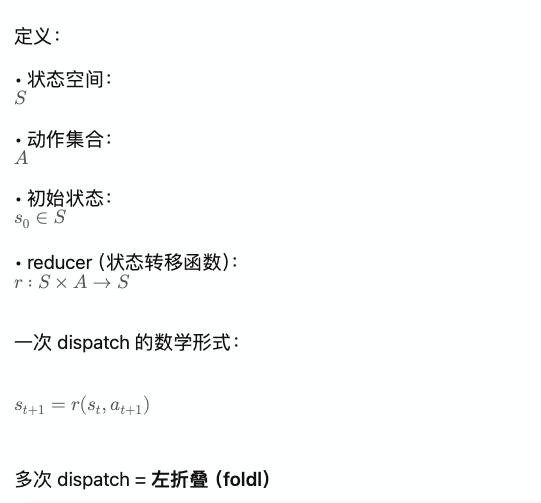
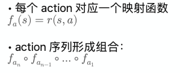
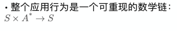
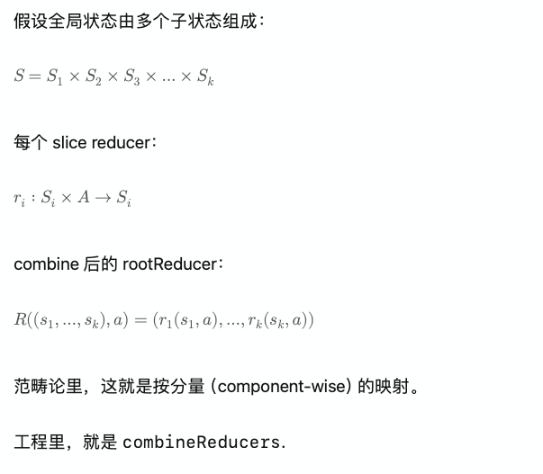

# Redux 源码的 FP 解析（工程版 / 数学版）

Redux 往往被描述为“函数式编程（FP）风格的状态管理库”。
但大多数前端面试和工程讨论只停留在：

* “reducer 是纯函数”
* “state 要 immutable”
* “middleware 是个链”
* “combineReducers 组合一下”

这些解释太浅，不足以让一个做过科研或读过论文的人真正“觉得清楚”。
因此，这篇文章提供两种视角：

1. **工程版 FP 解释（工程师能看懂并能落地）**
2. **数学结构版 FP 解释（博士 / CTO 比较熟悉）**

---

## 1. Redux 核心源码（极简可读版）

为了讨论 FP，我们先给出一个特别简化的 Redux 核心实现：

```js
function createStore(reducer, preloadedState) {
  let currentReducer = reducer
  let currentState = preloadedState
  let currentListeners = []

  function getState() {
    return currentState
  }

  function subscribe(listener) {
    currentListeners.push(listener)
    return () => {
      const index = currentListeners.indexOf(listener)
      currentListeners.splice(index, 1)
    }
  }

  function dispatch(action) {
    // ❶ reducer 是纯函数
    currentState = currentReducer(currentState, action)

    // ❷ notify listeners（副作用出口）
    for (const listener of currentListeners) {
      listener()
    }
    return action
  }

  // 初始化
  dispatch({ type: "@@redux/INIT" })

  return {
    getState,
    dispatch,
    subscribe,
  }
}
```

Redux 的 FP 本质，都在这个 30 行源码里。

---

## 2. 工程版：Redux 为什么是 FP 风格？

### 2.1 reducer：被强制“纯函数”

```js
function reducer(state, action) {
  switch (action.type) {
    case 'INC':
      return { ...state, count: state.count + 1 }
    default:
      return state
  }
}
```

工程上的 FP 特征：

* **pure function（纯函数）**
  同样输入 → 同样输出
* **无副作用（no side-effect）**
* **不修改原对象（immutability）**

工程收益：

* 单元测试简单
* debug 可回放（time-travel）
* 行为完全可预测

---

### 2.2 createStore：闭包封装状态（State Machine）

Redux 的 store 是：

* 闭包中的可变状态 `currentState`
* 可控的唯一更新入口 `dispatch`
* 纯逻辑统一走 reducer

这是一种 **“核心纯函数 + 外围受控副作用”** 的 FP 架构。

---

### 2.3 combineReducers：高阶函数 + 函数组合

```js
function combineReducers(reducers) {
  return function rootReducer(state = {}, action) {
    const nextState = {}
    for (const key in reducers) {
      nextState[key] = reducers[key](state[key], action)
    }
    return nextState
  }
}
```

FP 特征：

* **higher-order function（高阶函数）**
* **函数组合**
* **按 slice 组合状态空间**

工程收益：

* 模块化
* 独立可重构
* 全局 reducer 变成简单的“数学直积”

---

### 2.4 middleware：FP 风格的 dispatch 装饰器链

```js
function applyMiddleware(...middlewares) {
  return createStore => (reducer, preloadedState) => {
    const store = createStore(reducer, preloadedState)
    let dispatch = store.dispatch

    const middlewareAPI = {
      getState: store.getState,
      dispatch: (action) => dispatch(action)
    }

    const chain = middlewares.map(mw => mw(middlewareAPI))
    dispatch = chain.reduceRight((next, mw) => mw(next), dispatch)

    return { ...store, dispatch }
  }
}
```

FP 特征：

* 中间件是高阶函数：`mw(api) => next => action => ...`
* 最终 dispatch = 多个函数的组合
* 独立副作用逻辑被组合在一起，不污染 reducer

工程收益：

* 日志、异步、异常处理等逻辑可插拔
* reducer 始终保持纯净

---

## 3. 数学版：Redux 的 FP 模型化

数学视角让 Redux 的结构清晰可见。

---

### 3.1 状态空间与转移函数（State Transition System）




```js
actions.reduce((s, a) => reducer(s, a), initialState)
```

也可以视为函数组合：



这就是 Redux time-travel debug 的数学原理。

---

### 3.2 不变性（immutability）带来可证明性

* reducer 是纯函数
* state 是不可变更新的

因此：



这保证：

* 可预测性
* 可测试性
* 可回放性
* 可日志/快照化

---

### 3.3 combineReducers 的笛卡尔积结构



工程里，就是 `combineReducers`.

---

### 3.4 middleware = 一种可组合的“态映射变换器”

简单类比：

* **reducer：状态转移函数**
* **middleware：状态转移函数的变换器**

它与范畴论里「morphism → morphism」的结构保持变换非常相似。

不用懂类范畴论也能理解：
Redux middleware 实现的是 **dispatch 的函数组合链**。

---

## 4. Redux 是 FP 思想在前端的成熟落地

综合来看：

| 部分              | FP 概念  | 工程意义       |
|-----------------|--------|------------|
| reducer         | 纯函数    | 可重放、可测试    |
| state           | 不变性    | 可预测、易 diff |
| createStore     | 封装可变状态 | 受控副作用      |
| combineReducers | 函数组合   | 模块化状态      |
| middleware      | 高阶函数链  | 扩展行为       |

你可以把 Redux 看成：

> 一个由纯函数组成的状态机，
> 由受控副作用推动，
> 结构清晰、数学友好、工程完全可落地。
